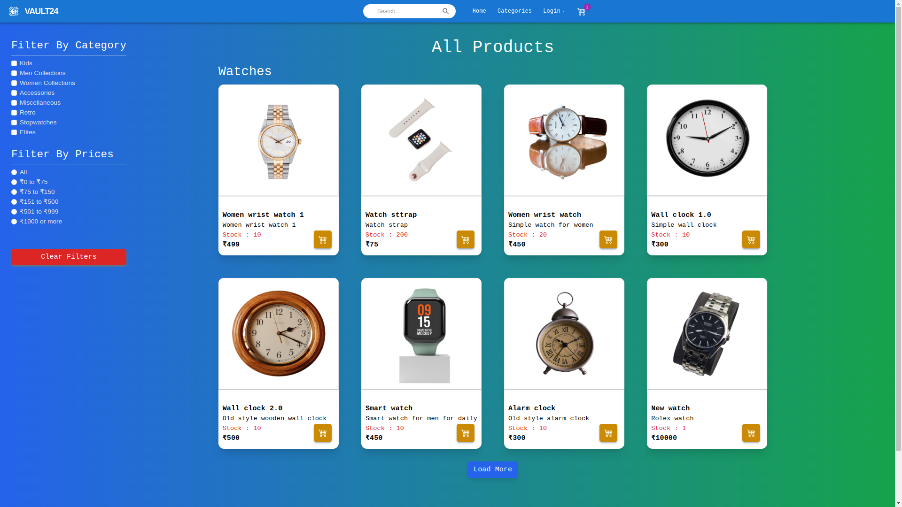
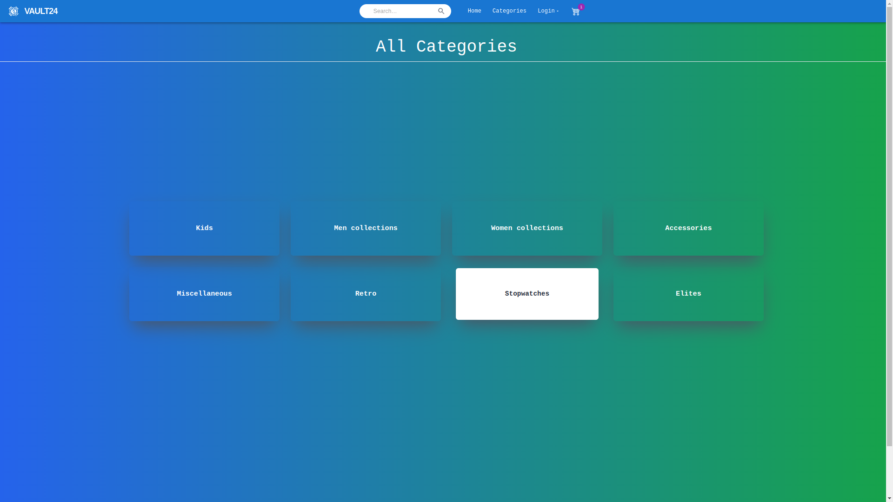
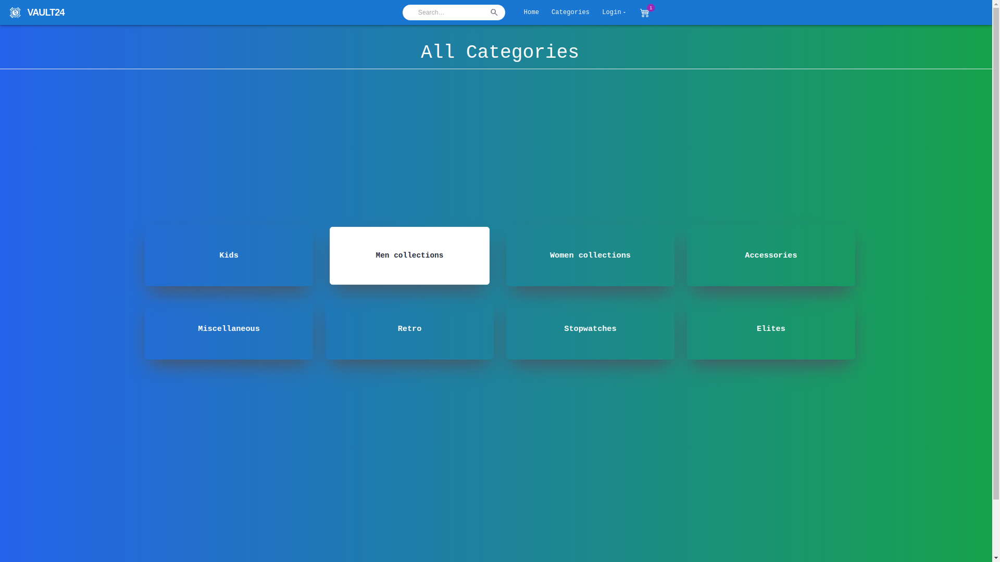
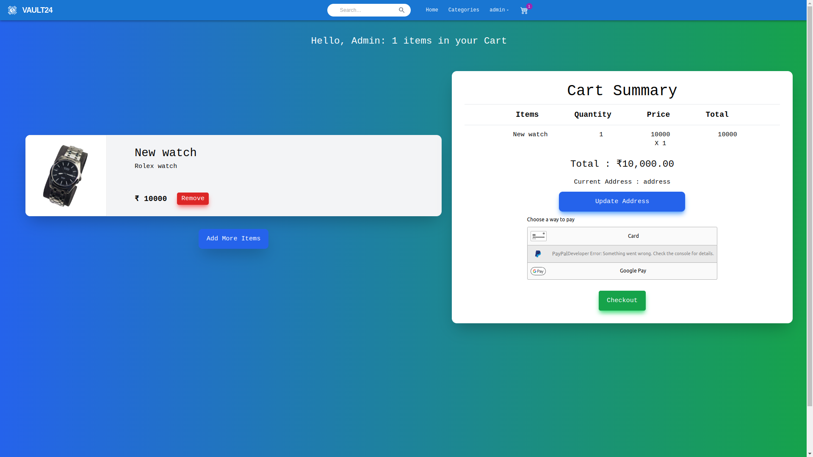
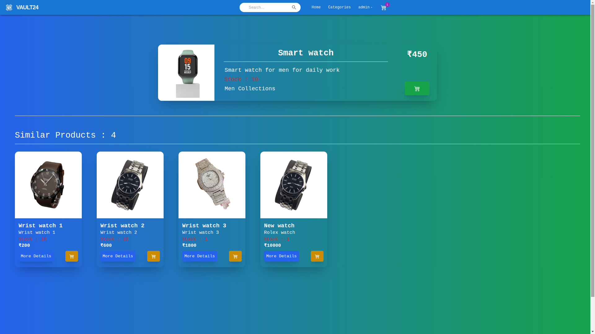
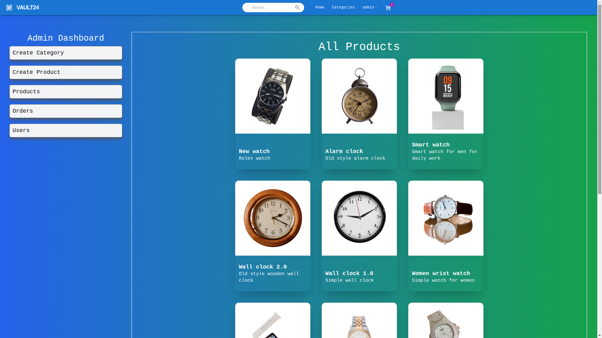
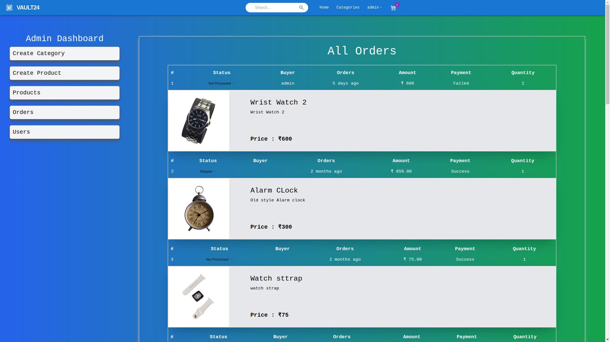

# 🕰️ E-commerce Platform for Watches

An eCommerce platform built with the MERN stack for selling luxury and fashion watches. This project features a responsive interface, an admin dashboard, email notifications, and integrated payment processing for a streamlined shopping experience.

## Deployment Link

[Add your deployment link here]

## Table of Contents
- [Features](#features)
- [Technologies](#technologies)
- [Prerequisites](#prerequisites)
- [Getting Started](#getting-started)
- [Available Scripts](#available-scripts)
- [Deployment](#deployment)
- [Contributing](#contributing)
- [License](#license)


## Deployment Link 
[https://vault24.onrender.com/]

## Features

- **Responsive User Interface**: Built with React, Material UI, and Tailwind CSS.
- **Admin Dashboard**: For managing products, orders, and user information.
- **Email Integration**: Automated email notifications via Nodemailer.
- **Payment Integration**: Braintree for secure payment processing.
- **Real-time Notifications**: User-friendly toast notifications.
- **Authentication**: User authentication using Firebase.
- **Environment Configurations**: `.env` setup for secure credentials.

## Screenshots









## Technologies

### Frontend
- **React** with **Vite** for a fast, interactive interface.
- **Material UI & Tailwind CSS** for styling.
- **Axios** for handling API requests.
- **Braintree Web Drop-in** for payment integration.

### Backend
- **Node.js & Express**: RESTful API and server setup.
- **MongoDB & Mongoose**: Database for managing products, users, and orders.
- **Nodemailer** for email notifications.
- **JWT** for secure token-based authentication.

## Prerequisites

- **Node.js**: Version 14 or higher.
- **MongoDB**: Running instance or MongoDB Atlas.
- **Firebase Project**: Set up Firebase for user authentication.
- **Braintree Account**: For payment gateway setup.

## Getting Started

1. **Set up the Environment Variables, Install Dependencies, and Run the Application**:

    ```bash
    # Clone the Repository
    git clone https://github.com/ayush625sri/vault24.git
    cd vault24

    # Set Up Environment Variables
    # Update the values in sample.env with your API keys and rename it to .env
    
    # Install server dependencies
    npm install
    
    # Install client dependencies
    npm install --prefix client

    # Start both the server and client concurrently
    npm run dev
    ```

2. **Build for Production**:
    ```bash
    npm run build --prefix client
    ```

## Available Scripts

### Root (Server) Directory Scripts
- `npm run start`: Starts the backend server.
- `npm run server`: Starts the backend server with **Nodemon** for hot-reloading.
- `npm run client`: Starts the client application.
- `npm run dev`: Runs both the server and client concurrently using **concurrently**.

### Client Directory Scripts
- `npm run start`: Starts the frontend development server on port 3000.
- `npm run build`: Builds the client app for production.
- `npm run preview`: Previews the production build.
- `npm run lint`: Runs **ESLint** to detect and fix code issues.

## Deployment

To deploy, build the client and configure the server to serve static assets. Then, deploy the server (e.g., to Vercel) and the database (e.g., to MongoDB Atlas).

## Contributing

Contributions are welcome! Follow project standards and conventions.

## License

This project is licensed under the ISC License.
